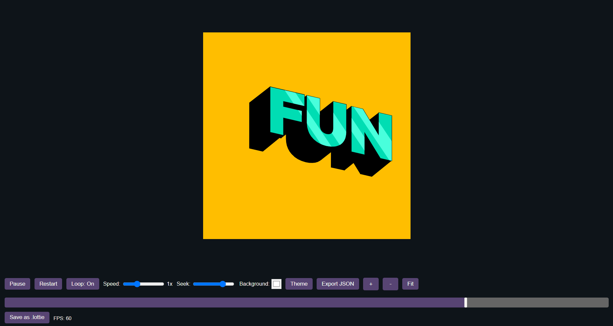
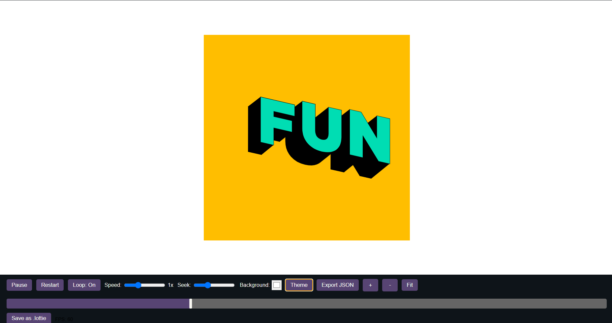
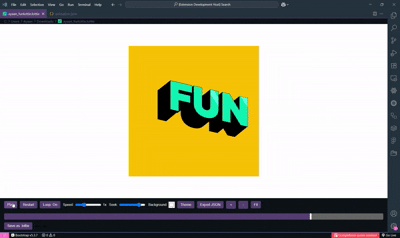

# 🎨 Lottie Studio

**Lottie Studio** is a modern, intuitive Visual Studio Code extension for developers, designers, and motion artists to **preview, scrub, inspect, and export** Lottie animations (`.json` & `.lottie`) right inside your editor.

---






## ✨ Features

✅ Preview `.json` and `.lottie` animations  
✅ Play, pause, loop, restart, and change speed  
✅ Zoom, fit-to-screen, and theme toggle (dark/light)  
✅ Custom timeline scrub with draggable thumb  
✅ Real-time FPS counter  
✅ Export as `.json` or `.lottie`  
✅ Timeline thumbnails and live drag preview  
✅ Beautiful, clean interface designed for creative workflows

---

## 🚀 Usage

1. Install **Lottie Studio** from the marketplace.
2. Open any `.json` or `.lottie` file in VSCode.
3. It will open automatically in the **Lottie Studio editor**.
4. Use the controls on top to preview, scrub, export, and explore.

---

## 🛠 **Commands & Controls**

- Play / Pause
- Restart animation
- Toggle looping
- Change playback speed
- Zoom in / out / fit to screen
- Timeline scrub and preview thumbnails
- Export `.json` or `.lottie`

---

## 📦 **Installation**

You can:

- Install directly from the VSCode marketplace.
- Or build locally:

```bash
npm install
npm run compile
vsce package
code --install-extension lottie-studio-0.0.1.vsix
```
